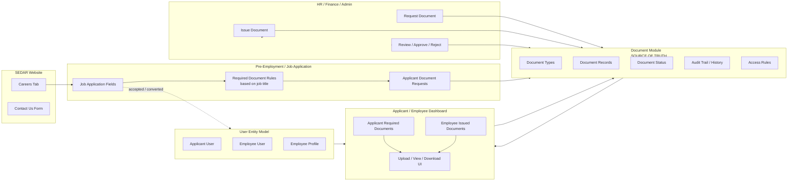
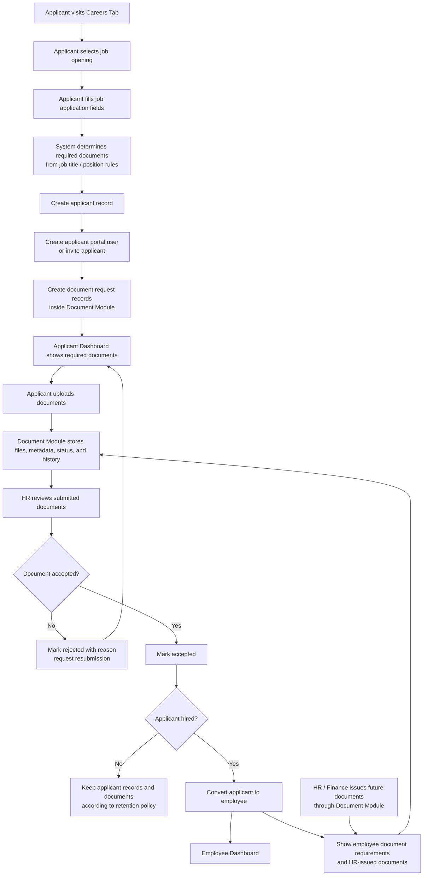

# SEDAR Odoo Planning Flowcharts

## Core Principle

The Document Module is the source of truth for every document that moves through the Odoo system.

Other modules may request, display, approve, or consume documents, but they should not own document CRUD, document storage, document status, or document history.

## Level 1: System Boundary Flow

## Level 2: Hiring And Document Lifecycle

## Suggested Module Boundaries

### Website / Careers

Owns:
- Public job listing display
- Public application entry point
- Contact form routing

Does not own:
- Document storage
- Document validation state
- Employee profile data

### Job Application / Hiring

Owns:
- Applicant record
- Job application fields
- Hiring pipeline status
- Mapping selected job title to required document rules
- Conversion from applicant to employee

Does not own:
- Raw document CRUD
- HR-issued employee documents
- Long-term document history

### Document Module

Owns:
- Document type definitions
- Document request records
- Uploaded files
- Document metadata
- Document status: requested, submitted, under review, accepted, rejected, expired
- Document ownership and relation to applicant, employee, department, or company
- Audit trail
- Access control rules
- Expiration and renewal tracking

Does not own:
- Hiring decision
- Employee master profile fields
- Finance or HR business decisions

### Applicant / Employee Dashboard

Owns:
- User-facing document views
- Upload, download, and status display
- Notifications or reminders shown to the user

Does not own:
- Document CRUD logic
- Document status authority
- Required document rules

### HR / Finance / Admin

Owns:
- Requesting documents
- Issuing documents
- Reviewing documents
- Approving or rejecting submitted documents

Does not own:
- Separate document storage outside the Document Module

## Development Notes

- Treat every document as a `document.record` or equivalent central model.
- Link documents to business entities using references such as applicant, employee, department, job position, or request owner.
- The dashboard should query the Document Module instead of duplicating document state.
- Hiring should create document requests, not documents directly owned by the hiring module.
- Employee conversion should preserve applicant document history.
- HR-issued documents should use the same document lifecycle as applicant-uploaded documents where possible.

